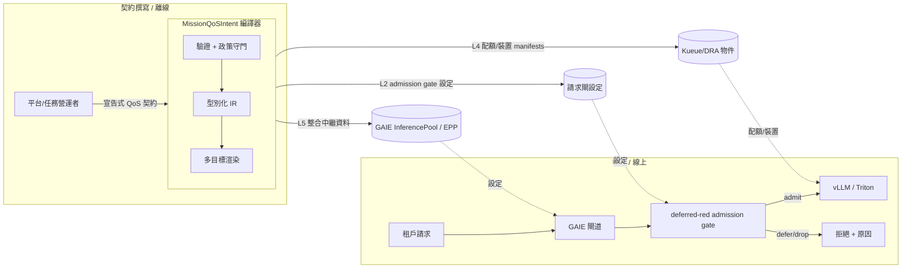
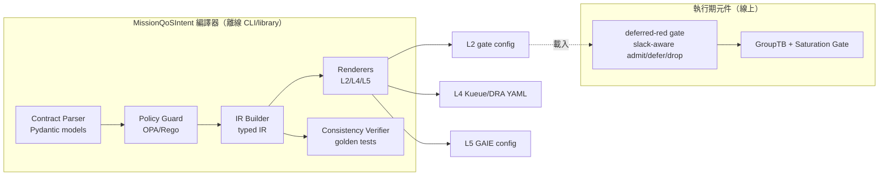
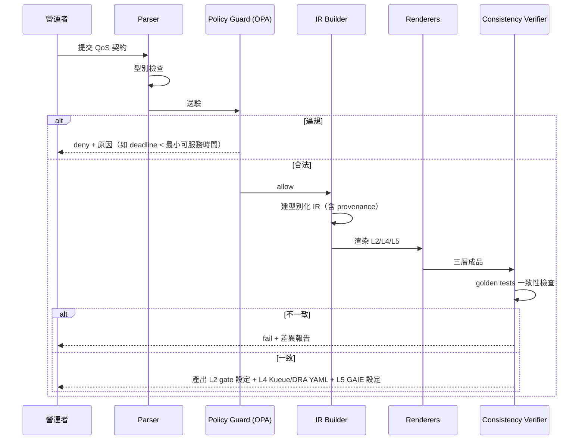
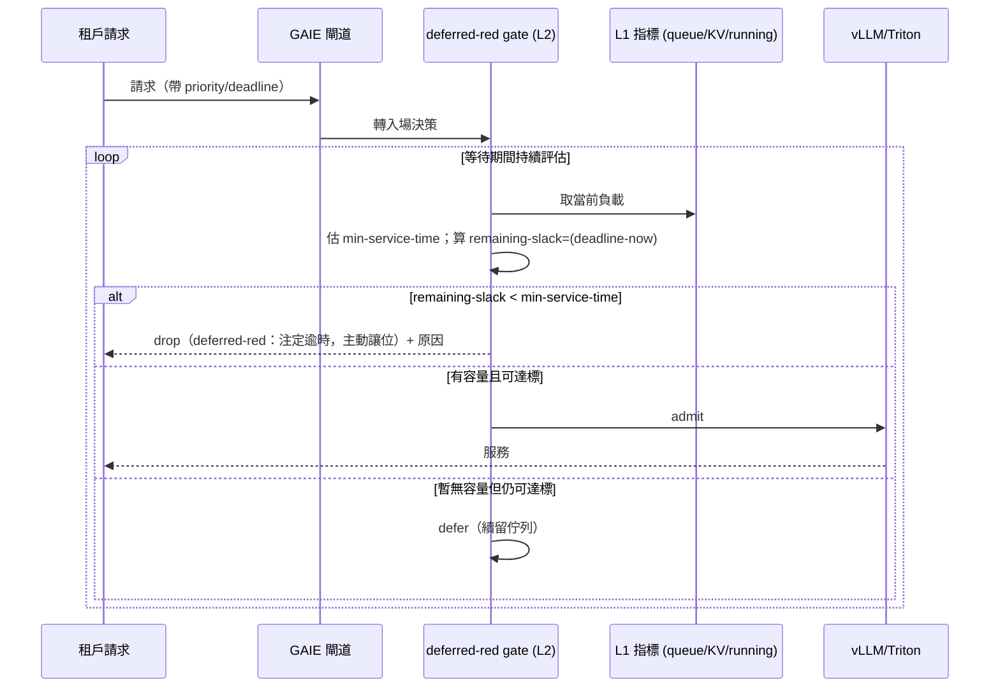
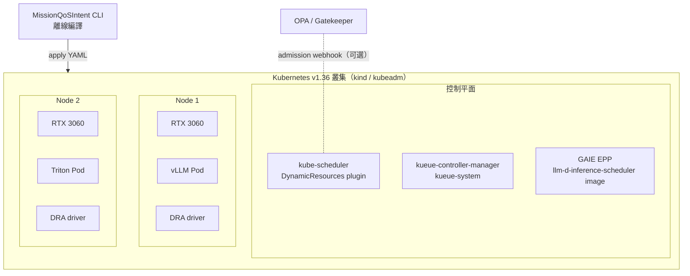
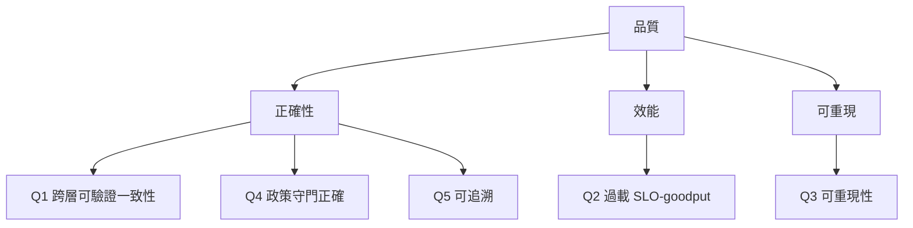

# Software Design Document — MissionQoSIntent

> **系統**：MissionQoSIntent — 把宣告式任務/租戶 QoS 契約，經政策守門的型別化 IR，編譯為跨層、可驗證的 admission/scheduling 控制平面（Kubernetes 上的多租戶 GenAI 推論）
> **作者**：Hsiu-Chi Tsai（NYCU）  ·  **日期**：2026-06-25  ·  **版本**：v0.1.0  ·  **格式**：arc42（12 段）
> **狀態**：研究計畫（WIP）。本文描述設計與計畫，非既有生產系統的事後文件。
> **技術版本基準（2026-06-25 重查）**：Kubernetes v1.36 · Kueue v0.18.1（`kueue.x-k8s.io/v1beta2`）· Gateway API Inference Extension v1.5.0

目錄
1. [Introduction and Goals 引言與目標](#1-introduction-and-goals-引言與目標)
2. [Architecture Constraints 架構限制](#2-architecture-constraints-架構限制)
3. [Context and Scope 脈絡與範圍](#3-context-and-scope-脈絡與範圍)
4. [Solution Strategy 解決策略](#4-solution-strategy-解決策略)
5. [Building Block View 建構塊視圖](#5-building-block-view-建構塊視圖)
6. [Runtime View 執行視圖](#6-runtime-view-執行視圖)
7. [Deployment View 部署視圖](#7-deployment-view-部署視圖)
8. [Crosscutting Concepts 橫切概念](#8-crosscutting-concepts-橫切概念)
9. [Architecture Decisions 架構決策](#9-architecture-decisions-架構決策)
10. [Quality Requirements 品質需求](#10-quality-requirements-品質需求)
11. [Risks and Technical Debt 風險與技術債](#11-risks-and-technical-debt-風險與技術債)
12. [Glossary 詞彙表](#12-glossary-詞彙表)

---

## 1. Introduction and Goals 引言與目標

### 1.1 Requirements Overview 需求概述

**研究問題（一句）**：能否把宣告式的任務/租戶 QoS 契約，透過政策守門的型別化 IR，編譯成一個**可驗證、跨層**的 admission-and-scheduling 控制平面，服務 Kubernetes 上的多租戶 GenAI 推論？

**本系統把兩個前置專題整合為一**：
- **(A) mission-semantics → QoS**：把任務語意（例如衛星/邊緣場景中「緊急路由」「城市監測」「事件查證」「歷史分析」四類工作負載）轉成可計算的 QoS 參數。提供**研究問題**。
- **(B) 機制層**：GroupTB（群組 token-bucket）、Saturation Gate（飽和閘）、deferred-red（延遲紅燈：等待期間持續判斷能否在期限內服務、否則主動丟）。提供**實作機制**。

**功能需求（FR）**：
- **FR-1 契約定義**：使用者以宣告式 schema 定義每租戶/任務的 QoS 契約：`priority`、`deadline`（端到端期限）、`assuranceRatio`（保證達成率）、`resourceClass`（裝置類別）、`fallback`（降級/拒絕策略）。
- **FR-2 政策守門**：契約須先通過 policy-as-code 守門（OPA/Rego）才可編譯；違規（如租戶請求超出其授權上限、deadline 低於系統最小可服務時間）被拒並回報原因。
- **FR-3 編譯為型別化 IR**：合法契約被解析、型別檢查，產生一份**單一事實來源（single source of truth）** 的型別化 IR。
- **FR-4 多目標渲染**：IR 渲染為三層成品——
  - **L2 request-level admission**：deadline-slack-aware 的 deferred-red 閘（見 §4、ADR-0004）。
  - **L4 quota/裝置**：Kueue `ClusterQueue`/`LocalQueue`/`ResourceFlavor` 配額 ＋ DRA `ResourceClaim`/`ResourceClaimTemplate`/`DeviceClass`。
  - **L5 閘道整合中繼資料**：Gateway API Inference Extension（GAIE）的 `InferencePool`／EPP 設定參照。
- **FR-5 跨層一致性驗證**：產出的 L2/L4/L5 成品須**彼此一致**（例如 L4 的配額單位與 L2 的 admission 計數對齊、L5 的優先級分帶與契約 priority 對齊），且此一致性可被機器檢查（golden tests）。
- **FR-6 可觀測**：admission 決策（admit/defer/drop）、goodput、SLO 達成率、各層拒絕原因均可量測匯出。

**非功能需求（NFR）**：見 §10（品質需求）。最重要五項：**跨層可驗證一致性、過載下的 SLO-goodput、可重現性、政策守門正確性、跨層可追溯性**。

### 1.2 Quality Goals 品質目標（前五，依優先序）

| # | 品質目標 | 場景化定義（可量測） |
|---|---|---|
| Q1 | **跨層可驗證一致性 (verifiable cross-layer consistency)** | 給定任一合法契約，編譯產出的 L2/L4/L5 成品通過自動一致性檢查（golden tests）；注入不一致（如改 L4 配額不改 L2 計數）必被測試攔下。**這是本研究最強的貢獻腿。** |
| Q2 | **過載下的 SLO-goodput** | 在 1.0–1.5× 容量過載下，相對於「FCFS/503」與「GAIE 開 `edf`/`slo-deadline` ordering」baseline，本系統的 useful goodput（只計完成且達 SLO 的請求）與高優先級 deadline 達成率不劣化、最好更佳。 |
| Q3 | **可重現性 (reproducibility)** | 全部實驗可在 2×RTX 3060 commodity 硬體、kind/kubeadm、固定版本（K8s 1.36 / Kueue v0.18.1 / GAIE v1.5.0）下重跑；產物與設定皆公開、有 DOI。 |
| Q4 | **政策守門正確性 (policy-guard correctness)** | OPA/Rego 守門規則對「已知合法／已知違規」契約樣本以 `opa eval` 單元測試全綠；無 false-allow。 |
| Q5 | **跨層可追溯性 (traceability)** | 任一 L2/L4/L5 成品欄位可回溯到 IR 節點，IR 節點可回溯到契約欄位與任務語意來源（provenance link）。 |

### 1.3 Stakeholders 利害關係人

| 角色 | 期望 |
|---|---|
| 作者（研究生） | 可完成的碩士論文範圍；可投稿的成品；upstream 可見度 |
| 論文 reviewer（ICPE/Middleware/IC2E 類） | 清楚的新穎性界定、誠實的前案比較、可重現的實驗 |
| 研討會 reviewer（OpenSSF/OSS Japan/KubeCon） | 已完成、可 demo、可引用的開源貢獻；非行銷、非願景樣板 |
| upstream 社群（Kueue/GAIE/DRA SIG） | 互補而非重造輪子的貢獻；正確使用既有 API |
| 指導教授 | 風險可控、範圍收斂、與既有發表（衛星任務編譯器）連續 |

> **可信度資產（待作者確認）**：Kueue v0.18 release notes 含一筆 `#12094, @thc1006` 的修復——「DRA: Fixed hot reconcile loops for inadmissible Workloads with deterministic DRA resolution failures」。**若 `@thc1006` 為作者本人 handle，這是直接的 upstream Kueue+DRA 貢獻證據，應在投稿 bio 與 ADR-0006 引用。** 本套件未假設其為真，請作者確認。

---

## 2. Architecture Constraints 架構限制

### 2.1 技術限制

| 限制 | 內容 | 來源/影響 |
|---|---|---|
| C-T1 硬體 | 評估平台為 2×RTX 3060（commodity GPU），非資料中心級 | 所有效能宣稱限定於此規模；不宣稱絕對吞吐，只宣稱**控制路徑正確性與相對 goodput**（見 §11 R-2） |
| C-T2 Kubernetes | 目標 K8s **v1.36**（DRA 核心於 v1.34 GA，v1.36 prioritized list GA、Device Taints/Tolerations beta、DRA Admin Access GA、Extended Resource via DRA beta） | DRA API 為 `resource.k8s.io/v1`（v1 預設供應；v1beta1 為儲存版） |
| C-T3 Kueue | **v0.18.1**，API `kueue.x-k8s.io/v1beta2`；`KueueDRAIntegration` feature gate 於 v0.18 升 **beta（預設開）**，`KueueDRAIntegrationExtendedResource` 為 alpha；DRA 配額計帳自 v0.17 起 alpha | 需 K8s 1.29+；未開 `DRAExtendedResources` 會對同一裝置雙重計費（requests + 自動建立的 ResourceClaim） |
| C-T4 GAIE | **v1.5.0**；Flow Control 為 experimental、`flowControl` feature gate 預設**關閉**；EPP/InferenceObjective/BBR 已遷往 `llm-d/llm-d-inference-scheduler`（issue #2430），本 repo 留 lightweight EPP + InferencePool API + conformance | 本系統**消費**而非重造 GAIE；設定檔 `EndpointPickerConfig`（`inference.networking.x-k8s.io/v1alpha1`）非 CRD，僅啟動時讀取、不可熱更新 |
| C-T5 推論引擎 | vLLM 與 Triton 為 L1 後端；採 vLLM Model Server Protocol 五項核心指標（`vllm:num_requests_waiting`、`vllm:num_requests_running`、`vllm:kv_cache_usage_perc` 等） | 指標經 GAIE data layer 的 `metrics-data-source`/`core-metrics-extractor` 取得 |
| C-T6 政策引擎 | OPA/Rego 為政策守門；可選 Gatekeeper（`ConstraintTemplate`+`Constraint`）作叢集端 admission webhook | OPA 內部即把 Rego 編譯為 AST→IR（AOT），可作為「契約→IR」設計的參照前例 |
| C-T7 IR 載體 | 沿用作者已發表編譯器的方法學：Pydantic（型別/驗證）＋ OPA/Rego（守門）＋ typed IR ＋ 多目標 renderer，已具 422 測試 | 本計畫是把該方法學從「批次工作流編譯」擴展到「runtime QoS 編譯」 |

### 2.2 組織限制

| 限制 | 內容 |
|---|---|
| C-O1 人力 | 單人研究生專題；範圍須收斂到一人可在論文週期內完成 |
| C-O2 時程 | 受研討會 CFP 約束：OpenSSF Community Day EU（7/12）、OSS Japan 2026（8/24）、KubeCon EU 2027（Barcelona 3/15–18，H2 2026 開 CFP）、ICPE 2027 類學術 workshop。**OSS EU 2026 CFP 已於 06-24 23:59 CEST 截止。** |
| C-O3 既有發表 | 須與已發表的「Satellite Mission Compiler」（DOI 10.5281/zenodo.19391965，EUPL-1.2）連續、可引用 |

### 2.3 慣例

- **文件**：arc42（本文）＋ MADR 4.0.0（ADR）＋ C4（圖）。
- **版本**：Semantic Versioning 2.0.0；變更紀錄遵循 Keep a Changelog 1.0.0。
- **政策即程式碼**：Rego 規則納入版本控制、附 `opa eval` 單元測試、設 dry-run 期、human-in-the-loop review（對齊 2026 業界 PaC 最佳實踐）。
- **ADR 與程式碼同 repo**：放 `docs/decisions/`，PR review，從程式碼反向連結，避免「Decision Documentation Theater」。

---

## 3. Context and Scope 脈絡與範圍

### 3.1 業務/領域脈絡



**領域邊界**：本系統負責「契約 → 跨層設定」的**控制路徑（control path）** 與「請求 → admit/defer/drop」的**入場決策**。它**不**負責 token 生成的 data path 吞吐最佳化（那是 vLLM/Triton/llm-d 的職責）。

### 3.2 技術脈絡（外部介面）

| 外部系統 | 介面 | 方向 | 資料 |
|---|---|---|---|
| OPA | Rego policy eval（`opa eval` / REST / library） | MQI → OPA | 契約 JSON → allow/deny + 原因 |
| Kubernetes API | `resource.k8s.io/v1`（DRA）；apply manifests | MQI → K8s | `ResourceClaim(Template)`/`DeviceClass`/`ResourceSlice` |
| Kueue | `kueue.x-k8s.io/v1beta2` | MQI → Kueue | `ClusterQueue`/`LocalQueue`/`ResourceFlavor`/`Workload` |
| GAIE/EPP | `EndpointPickerConfig`（`inference.networking.x-k8s.io/v1alpha1`）；`InferencePool` | MQI → GAIE | priority bands、ordering/fairness policy 參照、saturation detector 參數 |
| vLLM/Triton | Prometheus 指標（vLLM MSP 五指標） | L1 → GAIE data layer | queue depth、KV cache util、running reqs |
| 衛星任務編譯器（既有發表） | 共用方法學（Pydantic+Rego+IR+renderer，422 tests） | 基礎 | 本計畫之地基 |

### 3.3 範圍界定（明確排除）

- **不**重造 GAIE Flow Control / EPP / scheduler（消費既有）。
- **不**宣稱新的 data-path 排程演算法或 batch 機制。
- **不**宣稱生產級 SLA；只宣稱研究原型在 commodity 硬體上的相對表現與控制路徑正確性。
- **不**宣稱 maintainer 身分（除非 upstream 角色經確認）。

---

## 4. Solution Strategy 解決策略

### 4.1 基本決策（對應 ADR）

| 策略 | 摘要 | ADR |
|---|---|---|
| **整合 A+B 為一案** | A 提供研究問題（mission→QoS），B 提供機制（GroupTB/Saturation Gate/deferred-red） | [ADR-0001](docs/decisions/0001-integrate-project-a-and-b.md) |
| **型別化 IR 為單一事實來源** | 契約先成 IR，再從 IR 渲染所有層；避免各層各自為政、不一致 | [ADR-0002](docs/decisions/0002-typed-ir-as-single-source-of-truth.md) |
| **OPA/Rego 政策守門** | 編譯前先過 policy-as-code；可選 Gatekeeper 作叢集端強制 | [ADR-0003](docs/decisions/0003-policy-guard-opa-rego-gatekeeper.md) |
| **deferred-red 窄縫化＋由 contract 編譯** | 機制本身已近既有技術；唯一可辯護處＝「slack-aware dispatch-or-drop」＋「由 contract 編譯而來」＋「跨層一致」 | [ADR-0004](docs/decisions/0004-deferred-red-scope-vs-gaie.md) |
| **Kueue+DRA 作 L4** | 用 Kueue 管配額、DRA 管裝置；填補 arXiv 2602.04900（用 DAS）未覆蓋的 DRA 縫 | [ADR-0005](docs/decisions/0005-kueue-dra-for-quota-and-devices.md) |
| **GAIE 為整合邊界** | 消費 `InferencePool`/EPP；把貢獻定位為整合工程＋可驗證一致性 | [ADR-0006](docs/decisions/0006-gaie-integration-boundary.md) |
| **baseline 必含 GAIE EDF/SLO 組態** | 不能只比 FCFS/503，否則新穎性被視為重貼標籤 | [ADR-0007](docs/decisions/0007-evaluation-baselines.md) |

### 4.2 核心解法：compile-from-contract 五層映射

```mermaid
flowchart TB
    C[宣告式 QoS 契約<br/>priority/deadline/assuranceRatio/resourceClass/fallback]
    C --> G{OPA/Rego 政策守門}
    G -->|deny + reason| X[拒絕]
    G -->|allow| IR[型別化 IR<br/>單一事實來源]
    IR --> R1[L2 renderer]
    IR --> R2[L4 renderer]
    IR --> R3[L5 renderer]
    R1 --> A2[L2: deferred-red admission gate 設定]
    R2 --> A4[L4: Kueue ClusterQueue/LocalQueue/ResourceFlavor<br/>+ DRA ResourceClaim(Template)/DeviceClass]
    R3 --> A5[L5: GAIE InferencePool / EPP priority bands + ordering/fairness refs]
    A2 -. 一致性檢查 .- A4
    A4 -. 一致性檢查 .- A5
    A2 -. golden tests .- A5
```

**五層（L1–L5）職責**（詳見 `docs/architecture/layers-L1-L5.md`）：
- **L1 推論引擎**：vLLM/Triton，產生 token、匯出指標。（非本系統，外部）
- **L2 請求級 admission**：deferred-red 閘——等待期間持續計算 `remaining-slack =(deadline − now)` 與估計最小服務時間 `min-service-time`，當 `remaining-slack < min-service-time` 即**主動丟**（deferred-red），把容量讓給仍可達標的請求。**此閘由契約編譯而來，且與 L4/L5 一致。**
- **L3 群組節流**：GroupTB（群組 token-bucket）＋ Saturation Gate，依契約的群組/租戶配比限流。
- **L4 配額與裝置**：Kueue 管 quota reservation（配額預留 ≠ pod 排程）、DRA 管裝置宣告與配置。
- **L5 閘道**：GAIE `InferencePool` + EPP，做 endpoint 選擇與（可選）Flow Control 佇列。

### 4.3 達成品質目標的取徑

- **Q1 一致性**：所有層從同一 IR 渲染 → 結構上保證同源；再加 golden tests 攔截「改一層忘改另一層」。
- **Q2 goodput**：deferred-red 在過載時主動丟「注定逾時」請求，理論上把 GPU 時間留給可達標請求 → 提升 useful goodput。**須以 E3 對照 GAIE EDF/SLO baseline 實證（見 §10）。**
- **Q3 可重現**：固定版本 + commodity 硬體 + 公開設定 + DOI。
- **Q4 守門正確**：Rego 單元測試（known-good/known-bad）+ dry-run 期。
- **Q5 可追溯**：IR 每節點帶 provenance 欄位，回指契約與任務語意。

---

## 5. Building Block View 建構塊視圖

### 5.1 C4 Level 2（容器）概觀

詳見 `docs/architecture/c4-container.md`。主要建構塊：



### 5.2 各建構塊（黑箱描述）

| 建構塊 | 職責 | 輸入 | 輸出 | 備註 |
|---|---|---|---|---|
| **Contract Parser** | 解析並型別檢查宣告式契約 | 契約（YAML/JSON） | 已驗證的 Pydantic 物件 | 沿用既有編譯器方法學 |
| **Policy Guard** | policy-as-code 守門 | 契約物件 | allow/deny + 原因 | OPA/Rego；可選 Gatekeeper 叢集端 |
| **IR Builder** | 建立型別化 IR（單一事實來源） | 合法契約 | typed IR（含 provenance） | 對應 FR-3 |
| **Renderers (L2/L4/L5)** | 從 IR 渲染各層成品 | typed IR | L2 gate 設定 / L4 Kueue+DRA YAML / L5 GAIE 設定 | 對應 FR-4 |
| **Consistency Verifier** | 檢查跨層一致性 | 三層成品 | pass/fail + 差異報告 | golden tests；對應 FR-5、Q1 |
| **deferred-red gate**（執行期） | slack-aware admit/defer/drop | 請求 + 契約 deadline + L1 指標 | admit / defer / drop + 原因 | 對應 FR-4(L2)、Q2；見 ADR-0004 |
| **GroupTB + Saturation Gate**（執行期） | 群組/租戶節流 + 飽和保護 | 請求流 + 群組配比 | 限流後的請求流 | L3 |

### 5.3 與外部既有元件的關係

- **L4 Kueue**：`ClusterQueue`（叢集級資源池、配額、fair-sharing）、`LocalQueue`（namespace 級、單租戶）、`ResourceFlavor`（資源特徵，如裝置型號/可用性）、`Workload`（admission 單位）、`Cohort`（可互借配額的 CQ 群）。
- **L4 DRA**：`DeviceClass`（裝置藍圖、CEL 選擇器）、`ResourceClaim`（共享裝置；適合推論）、`ResourceClaimTemplate`（每 Pod 專屬裝置；適合訓練）、`ResourceSlice`（驅動發布的裝置清單）。
- **L5 GAIE**：`InferencePool`、`EndpointPickerConfig`（plugins / schedulingProfiles / saturationDetector / flowControl / data / parser / featureGates）。

---

## 6. Runtime View 執行視圖

### 6.1 場景一：契約編譯（離線）



### 6.2 場景二：請求入場（線上，deferred-red 核心）



> **與 GAIE 既有機制的關鍵差異**（見 ADR-0004）：GAIE 的 `edf-ordering-policy`/`slo-deadline-ordering-policy` 只**重排**佇列；`defaultRequestTTL` 是**固定逾時**（到時才丟，不問是否仍可達標）；`latency-slo-admitter` 在「無任一 endpoint 能達 SLO 時」即時拒 sheddable。deferred-red 的差異是**在等待期間持續以 slack vs min-service-time 判斷、提早放棄注定逾時者**，且**由 contract 編譯而來、與 L4/L5 一致**。此差異須由 E3 實證隔離。

### 6.3 場景三：跨層一致性驗證（CI）

營運者改契約 → 重新編譯 → Consistency Verifier 跑 golden tests：若 L4 配額單位與 L2 admission 計數、L5 優先級分帶與契約 priority 不一致，CI 失敗、阻擋 merge。對應 Q1/Q5。

---

## 7. Deployment View 部署視圖



**部署要點**：
- DRA driver 於各節點建立 `ResourceSlice`；`DeviceClass` 由叢集管理者建立。
- Kueue 於 `kueue-system` namespace；以 `kubectl apply --server-side -f .../v0.18.1/manifests.yaml` 安裝。
- GAIE EPP 以 `ghcr.io/llm-d/llm-d-inference-scheduler` 映像部署，`--config-file` 指向 `EndpointPickerConfig`。
- **DRA preemption 雷**：使用 `ResourceClaim` 的 Pod 若 PriorityClass 預設 `PreemptLowerPriority`，會增加 autoscaling 延遲 → 明確設 `preemptionPolicy: Never`。

---

## 8. Crosscutting Concepts 橫切概念

### 8.1 型別化 IR（核心概念）
單一事實來源。所有層成品皆由它渲染，結構上保證同源。每節點帶 `provenance`（回指契約欄位＋任務語意來源），支撐 Q5 可追溯。設計參照 OPA 內部「Rego→AST→IR（AOT 編譯）」的成熟前例。

### 8.2 政策即程式碼（policy-as-code）
OPA 模型：`input（契約 JSON）→ policy（Rego）→ decision（allow/deny + reason）`。Rego 受 Datalog 啟發、宣告式、set-based。守門規則版本控制、`opa eval` 單元測試、dry-run 期、human-in-the-loop。可選 Gatekeeper：`ConstraintTemplate`（規則本體）＋`Constraint`（套用範圍與參數）＋Controller。

### 8.3 跨層可驗證一致性（最強貢獻腿）
不只是「能跑」，而是「各層設定彼此不矛盾，且此性質可被機器證明」。實作為 golden tests：固定契約 → 固定三層成品；注入不一致必被攔。這是相對於 arXiv 2602.04900（已示範 Kueue+DAS+GAIE「能組合」）的差異化貢獻——**本系統貢獻的是「組合後的可驗證一致性」與「由 contract 編譯」**。

### 8.4 QoS 契約語意
`priority`（整數，高者優先，對齊 GAIE priority band）、`deadline`（端到端期限，對齊 L2 slack 計算與 GAIE EDF）、`assuranceRatio`（保證達成率，影響 defer/drop 門檻）、`resourceClass`（對齊 DRA `DeviceClass`）、`fallback`（降級或拒絕，對齊 GAIE sheddable/負優先級）。

### 8.5 可觀測性
匯出：admit/defer/drop 計數與原因、useful goodput、各優先級 SLO 達成率、佇列深度、KV cache util。對齊 vLLM MSP 五指標與 GAIE metrics。

### 8.6 任務語意 provenance（衛星/邊緣特色）
四類工作負載（emergency-routing / city-monitoring / incident-verification / historical-analysis）各自映射到不同 QoS 設定；此映射是本研究相對「又一個 SLO scheduler」的領域差異化。

---

## 9. Architecture Decisions 架構決策

完整 ADR 見 `docs/decisions/`（MADR 4.0.0 格式）。索引與狀態見 [`docs/decisions/README.md`](docs/decisions/README.md)。

| ADR | 標題 | 狀態 |
|---|---|---|
| [0001](docs/decisions/0001-integrate-project-a-and-b.md) | 整合專題 A 與 B 為單一論文 | Accepted |
| [0002](docs/decisions/0002-typed-ir-as-single-source-of-truth.md) | 以型別化 IR 為單一事實來源 | Accepted |
| [0003](docs/decisions/0003-policy-guard-opa-rego-gatekeeper.md) | 以 OPA/Rego（可選 Gatekeeper）為政策守門 | Accepted |
| [0004](docs/decisions/0004-deferred-red-scope-vs-gaie.md) | deferred-red 的範圍裁決（相對 GAIE） | Accepted（高風險，須實證） |
| [0005](docs/decisions/0005-kueue-dra-for-quota-and-devices.md) | 以 Kueue+DRA 作 L4 配額與裝置 | Accepted |
| [0006](docs/decisions/0006-gaie-integration-boundary.md) | 以 GAIE 為整合邊界（消費非重造） | Accepted |
| [0007](docs/decisions/0007-evaluation-baselines.md) | 評估 baseline 必含 GAIE EDF/SLO 組態 | Accepted |
| [0008](docs/decisions/0008-submission-venue-strategy.md) | 投稿場域策略 | Accepted（含時效） |

---

## 10. Quality Requirements 品質需求

### 10.1 品質樹（概覽）



### 10.2 品質場景與實驗對應（E1–E3）

| 實驗 | 對應品質 | 設計 | 通過判準 |
|---|---|---|---|
| **E1 一致性與守門** | Q1, Q4, Q5 | 對 N 個合法/違規契約跑編譯＋golden tests＋`opa eval` | 違規全被拒並回正確原因；注入不一致全被攔；無 false-allow |
| **E2 控制路徑價值 vs 吞吐** | Q2（正交性） | 比較「有/無 admission policy」對 policy/accounting 正確性與 data-path 吞吐的影響 | 證明貢獻在 control-path 正確性，與 data-path 吞吐正交（回應「classifier 不是瓶頸」異議，見 §11 R-2） |
| **E3 deferred-red 隔離（最關鍵）** | Q2 | 在 1.0–1.5× 過載下，對照三組 baseline：(a) FCFS/503；**(b) GAIE 開 `edf-ordering-policy`＋`slo-deadline-ordering-policy`＋`defaultRequestTTL`**；(c) 本系統 deferred-red | 本系統在 useful goodput 與高優先級 deadline 達成率上**至少不劣於 (b)**，最好更佳；且差異可歸因於「slack-aware 提早放棄」而非 (b) 已具的重排/逾時 |

> **E3 的 baseline (b) 是整份計畫的成敗關鍵**：若只比 (a)，reviewer 會說「GAIE 的 EDF/SLO ordering 早就會了」。必須比 (b) 才能證明 deferred-red 的窄縫有實證價值（見 ADR-0004、ADR-0007）。

---

## 11. Risks and Technical Debt 風險與技術債

| # | 風險/債 | 嚴重度 | 說明 | 緩解 |
|---|---|---|---|---|
| **R-1** | **新穎性侵蝕（最高）** | 高 | deferred-red 機制已近既有技術：SCORPIO「rejects unattainable」、Niyama「eager relegation」、arXiv 2604.06970「admit/defer/reject cost ladder」、arXiv 2603.00356（多租戶 K8s token pools）、GAIE `edf`/`slo-deadline`+`latency-slo-admitter` | **主新穎性改壓 compiler/IR/政策守門＋跨層可驗證一致性**；deferred-red 降為「窄縫 + 由 contract 編譯 + 跨層一致」，並以 E3 baseline (b) 實證；最壞情況把 deferred-red 重定位為整合工程貢獻（見 ADR-0004） |
| **R-2** | classifier 不是瓶頸 | 中 | 分類器 ~5M RPS 遠高於 GPU 服務 ~160–1K RPS，不在關鍵路徑 | 把貢獻重構為「control-path 的 admission policy 與 compiler/IR 正確性與可驗證性」，與 data-path 吞吐正交；以 E2 實證 |
| **R-3** | admission-vs-allocation timing gap | 中 | Kueue 只查配額、不知哪顆裝置；kube-scheduler 才實際配置；狀態變化時可能配置失敗 | 文件已載；以 `WaitForPodsReady` 作安全網；設計時明確區分 quota reservation 與 pod scheduling |
| **R-4** | GAIE Flow Control 實驗性、預設關 | 中 | `flowControl` feature gate 預設關閉；設定非 CRD、僅啟動讀取、不可熱更新 | 設計不依賴其熱更新；baseline 與本系統皆固定設定後重啟；明確標注實驗性 |
| **R-5** | DRA 配額雙重計費 | 低-中 | 未開 `DRAExtendedResources` 會對同裝置雙重計費 | 明確啟用對應 feature gate；E1 驗證計帳正確 |
| **R-6** | 單人範圍過大 | 中 | 五層整合對單人偏重 | 收斂：L1/L5 消費既有；自建只有 L2 gate + L3 節流 + 編譯器；分階段交付（見計畫時程） |
| **R-7** | commodity 硬體外推性 | 低 | 2×RTX 3060 結論難外推至資料中心 | 只宣稱相對 goodput 與控制路徑正確性，不宣稱絕對吞吐；明確標注規模限制 |
| **R-8** | 既有發表重疊風險 | 低 | 與衛星任務編譯器須區隔 | 明確定位為「方法學從批次→runtime QoS 的擴展」，非重複發表 |

---

## 12. Glossary 詞彙表

| 術語 | 定義 |
|---|---|
| **QoS 契約** | 宣告式描述某租戶/任務的服務品質要求：priority、deadline、assuranceRatio、resourceClass、fallback |
| **型別化 IR** | 契約編譯後的單一事實來源中間表示；所有層成品由它渲染 |
| **政策守門 (policy guard)** | 編譯前以 OPA/Rego 檢查契約合法性的關卡 |
| **deferred-red** | 等待期間持續以 `remaining-slack < min-service-time` 判斷、對注定逾時請求主動丟棄的入場機制 |
| **GroupTB** | 群組 token-bucket，依群組/租戶配比限流 |
| **Saturation Gate** | 飽和閘，過載時保護後端 |
| **跨層可驗證一致性** | L2/L4/L5 成品彼此不矛盾，且此性質可被機器檢查 |
| **DRA** | Dynamic Resource Allocation；K8s 動態資源配置（`resource.k8s.io/v1`，核心於 v1.34 GA） |
| **ResourceClaim / ResourceClaimTemplate / DeviceClass / ResourceSlice** | DRA 四種 API kind：請求/每-Pod 模板/裝置藍圖/裝置清單 |
| **Kueue** | K8s 原生 job 佇列；管 quota reservation 與 admission（`kueue.x-k8s.io/v1beta2`） |
| **ClusterQueue / LocalQueue / ResourceFlavor / Cohort** | Kueue 核心物件：叢集級資源池/namespace 級租戶佇列/資源特徵/可互借配額群 |
| **quota reservation vs admission** | Kueue 用語：配額預留（locking 配額）≠ admission（允許 pod 被建立）≠ pod scheduling |
| **GAIE** | Gateway API Inference Extension（v1.5.0）；推論閘道擴充 |
| **EPP / EndpointPickerConfig** | Endpoint Picker 及其設定（`inference.networking.x-k8s.io/v1alpha1`，非 CRD，啟動讀取） |
| **Flow Control（GAIE）** | 3-tier dispatch：Priority band → Fairness（flow）→ Ordering（request）；experimental、預設關 |
| **Ordering policy（GAIE）** | `fcfs-ordering-policy`（預設）/ `edf-ordering-policy`（最近期限優先）/ `slo-deadline-ordering-policy`（SLO 期限） |
| **Saturation Detector（GAIE）** | `utilization-detector`（queue depth + KV cache，預設）/ `concurrency-detector`（in-flight 計數） |
| **useful goodput** | 只計「完成且達 SLO」的請求速率 |
| **OPA / Rego / Gatekeeper** | 開源政策引擎 / 其宣告式語言 / 其 K8s admission 控制器 |
| **arc42 / MADR / C4** | 架構文件模板 / 架構決策記錄格式 / 架構視覺記法 |
