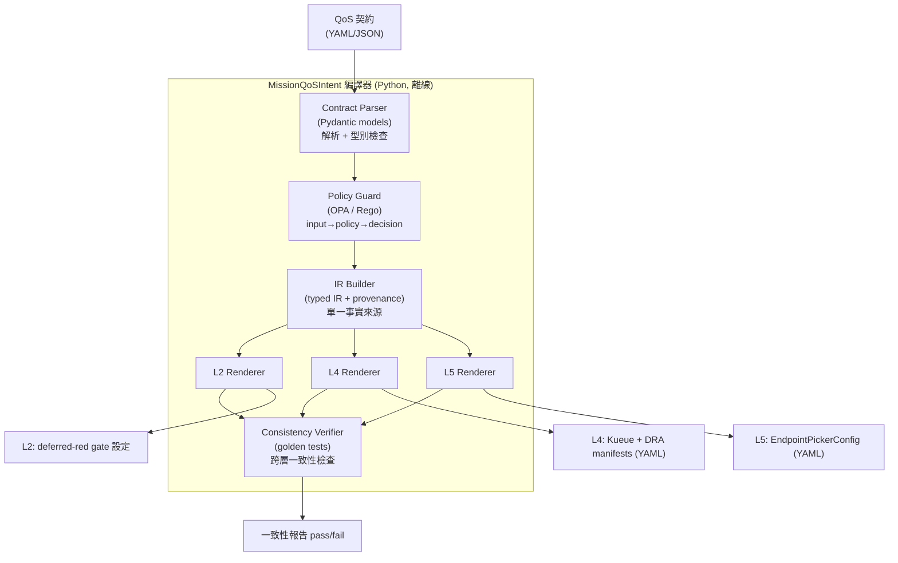
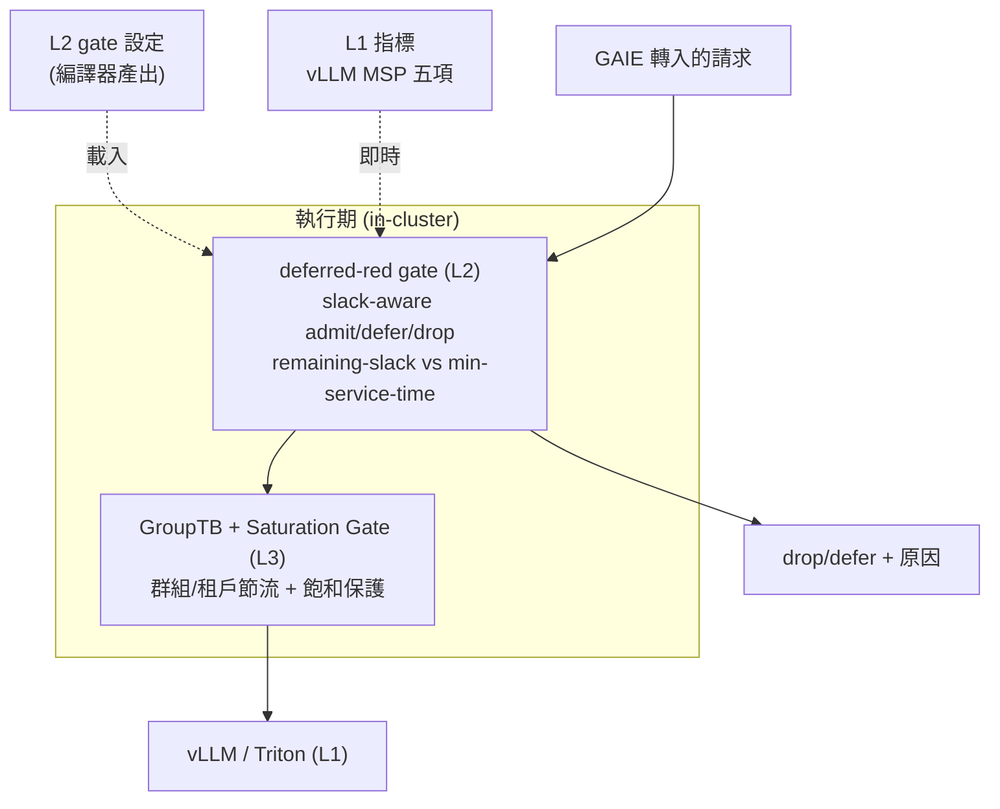

# C4 Model — Level 2：Container（容器）

> 把 MissionQoSIntent 拆成可獨立部署/執行的「容器」（此處「容器」是 C4 術語＝可執行單元，非 Docker container）。C4 L2 回答：「系統內部有哪些大塊、各自技術、如何溝通。」

## 編譯器（離線 CLI / library）

## 執行期元件（線上）

## 容器清單與技術選型

| 容器 | 性質 | 技術 | 對應 FR / 品質 |
|---|---|---|---|
| Contract Parser | 離線 | Python + Pydantic | FR-1 |
| Policy Guard | 離線（可選叢集端） | OPA / Rego（可選 Gatekeeper） | FR-2 / Q4 |
| IR Builder | 離線 | Python（typed IR） | FR-3 / Q5 |
| L2/L4/L5 Renderers | 離線 | Python templating | FR-4 / Q1 |
| Consistency Verifier | 離線（CI） | golden tests | FR-5 / Q1 |
| deferred-red gate | 線上 | 入場決策器 | FR-4(L2) / Q2 |
| GroupTB + Saturation Gate | 線上 | 群組限流器 | L3 |

## 設計重點

- **編譯器與執行期分離**：編譯器離線產出設定（對齊 GAIE 設定「啟動讀取、不可熱更新」的現況，見 ADR-0006），執行期只消費設定。
- **單一渲染源頭**：L2/L4/L5 皆由同一 IR 渲染（ADR-0002），是跨層一致性的結構保證。
- **Consistency Verifier 進 CI**：改契約 → 重編譯 → golden tests；不一致則擋 merge（SDD §6.3）。
