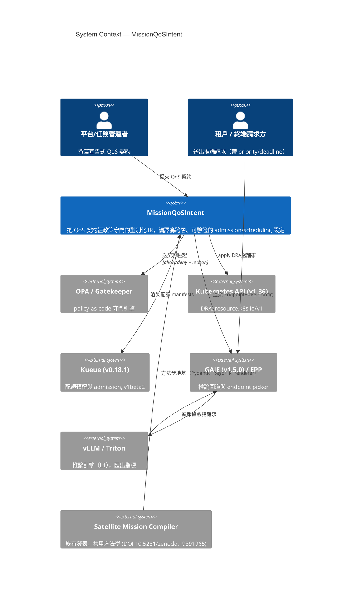

# C4 Model — Level 1：System Context（系統脈絡）

> MissionQoSIntent 與其外部人員/系統的關係。C4 L1 回答：「這個系統服務誰、與哪些外部系統互動。」

## 邊界說明

- **系統負責**：契約 → 跨層設定（control path）；請求 → admit/defer/drop（入場決策）。
- **系統不負責**：token 生成的 data-path 吞吐最佳化（vLLM/Triton/llm-d 職責）。

## 與外部系統的契約（介面摘要）

| 外部系統 | MQI 對它做什麼 | 版本/API（2026-06-25） |
|---|---|---|
| OPA / Gatekeeper | 送契約 JSON 求 allow/deny | Rego；Gatekeeper `ConstraintTemplate`+`Constraint` |
| Kubernetes | apply DRA 物件 | `resource.k8s.io/v1`（DRA 核心 v1.34 GA） |
| Kueue | 渲染 `ClusterQueue`/`LocalQueue`/`ResourceFlavor` | `kueue.x-k8s.io/v1beta2`（v0.18.1） |
| GAIE | 渲染 `EndpointPickerConfig`/`InferencePool` | `inference.networking.x-k8s.io/v1alpha1`（非 CRD） |
| vLLM/Triton | 消費其指標（經 GAIE data layer） | vLLM MSP 五指標 |
