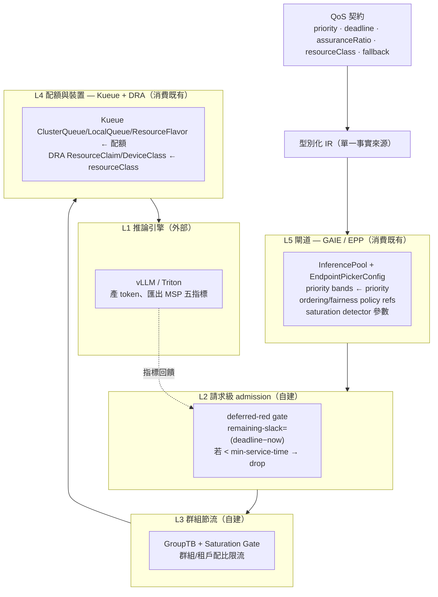

# 五層跨層對照（L1–L5）

> 本系統的核心是「同一份契約 → 五層彼此一致的設定」。本頁定義每層職責、所用既有元件、由 IR 渲染出的成品，以及層與層之間必須對齊的欄位（一致性檢查的對象）。

## 全景圖

## 各層定義

| 層 | 名稱 | 自建/消費 | 既有元件（2026-06-25 版本） | 由 IR 渲染出的成品 |
|---|---|---|---|---|
| **L1** | 推論引擎 | 外部 | vLLM / Triton | （不渲染；只消費其 5 指標：`vllm:num_requests_waiting`、`vllm:num_requests_running`、`vllm:kv_cache_usage_perc`、`vllm:lora_requests_info`、`vllm:cache_config_info`） |
| **L2** | 請求級 admission | **自建** | —（本研究核心機制之一） | deferred-red gate 設定（slack 門檻、min-service-time 估計來源） |
| **L3** | 群組節流 | **自建** | —（GroupTB / Saturation Gate） | 群組/租戶 token-bucket 配比、飽和門檻 |
| **L4** | 配額與裝置 | 消費 | Kueue v0.18.1（`v1beta2`）、DRA（`resource.k8s.io/v1`） | `ClusterQueue`/`LocalQueue`/`ResourceFlavor`/`Cohort`；`DeviceClass`/`ResourceClaim`/`ResourceClaimTemplate` |
| **L5** | 閘道 | 消費 | GAIE v1.5.0（`InferencePool`、`EndpointPickerConfig`） | priority bands、ordering/fairness policy 參照、saturation detector 參數 |

## 跨層必須對齊的欄位（一致性檢查對象）

這是 **Q1（跨層可驗證一致性）** 的具體檢查清單——golden tests 要驗的就是這些對齊關係：

| 契約欄位 | → L2 | → L4 | → L5 | 一致性不變式（invariant） |
|---|---|---|---|---|
| `priority` | gate 內優先序 | Kueue `WorkloadPriorityClass` | GAIE priority band（整數，高者優先） | 三層的相對優先序必須單調一致 |
| `deadline` | slack 計算基準 | （影響 admission 時序預期） | GAIE `edf`/`slo-deadline` 期限 | L2 slack 基準與 L5 EDF 期限同源 |
| `assuranceRatio` | defer/drop 門檻 | 配額預留比例 | priority band 的 maxRequests/maxBytes | 保證率越高 → 配額越足 + drop 門檻越鬆 |
| `resourceClass` | （無直接） | DRA `DeviceClass` + CEL 選擇器 | InferencePool 後端選擇 | L4 選到的裝置類別與 L5 後端池一致 |
| `fallback` | drop 行為 | （無直接） | GAIE sheddable / 負優先級 | L2 drop 與 L5 sheddable 語意一致 |

## 已知跨層陷阱（設計時必須處理）

- **admission-vs-allocation timing gap（L4）**：Kueue 只查配額（quota reservation），不知哪顆裝置；kube-scheduler 才實際配置（DRA allocation）。狀態變化時可能配置失敗 → 以 `WaitForPodsReady` 作安全網（SDD §11 R-3）。
- **DRA 配額雙重計費（L4）**：未開 `DRAExtendedResources` 會對同裝置同時計 `requests` 與自動建立的 `ResourceClaim`（R-5）。
- **DRA preemption 延遲（L4）**：`ResourceClaim` 的 Pod 預設 `PreemptLowerPriority` 增 autoscaling 延遲 → 設 `preemptionPolicy: Never`。
- **GAIE 設定不可熱更新（L5）**：`EndpointPickerConfig` 僅啟動讀取 → 改設定需重啟 EPP（R-4）。
- **Flow Control 預設關（L5）**：`flowControl` feature gate 預設關閉；baseline 與本系統都須明確開啟並標注實驗性。
